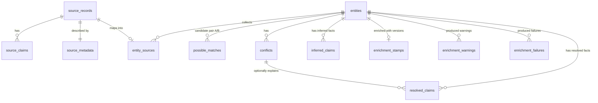

# SQLite Data Model

This document describes the relational data model in `pipeline/pipeline.db`.

For ontologists, the key framing is:

- the ontology lives in `ontology/*.ttl`
- the SQLite database is an operational curation model
- SQLite is not a relational rewrite of the ontology
- SQLite exists to manage source assertions, identity resolution, deterministic reconciliation, enrichment bookkeeping, and RDF assembly

In other words: the ontology defines the semantic contract, while SQLite holds the workflow state needed to produce a governed graph from messy source data.

---

## What SQLite Is For

The pipeline needs a place to store:

- source-record-level assertions before records are merged into canonical entities
- cross-source identity decisions
- deterministic reconciliation output
- LLM-derived claims and enrichment bookkeeping
- review and recovery state such as possible matches, stripped terms, and failures

Those are operational concerns. They are important, but they are not themselves the public ontology.

---

## Relational Shape

The flow is:

1. `source_records` and `source_claims` capture what each upstream dataset says.
2. `entities` and `entity_sources` turn multiple source records into one canonical exercise.
3. `resolved_claims` records deterministic post-reconciliation facts.
4. `inferred_claims` fills gaps left by deterministic stages.
5. `build.py` materializes RDF from the effective claim set.

---

## Table Dictionary

### `source_records`

One row per upstream exercise record.

Columns:

- `source`: source system key such as `free-exercise-db`
- `source_id`: source-local exercise identifier
- `display_name`: human-readable exercise label from the source

Key:

- primary key: `(source, source_id)`

Role:

- the identity anchor for raw source exercises before canonicalization across sources

### `source_claims`

Source-asserted facts attached to a specific source record.

Columns:

- `source`, `source_id`: foreign key back to `source_records`
- `predicate`: pipeline claim predicate such as `muscle`, `movement_pattern`, `laterality`
- `value`: local-name-like value or scalar literal stored as text
- `qualifier`: optional extra meaning, most importantly muscle degree hints
- `origin_type`: current values are `structured` or `inferred`

Key:

- surrogate primary key: `id`

Role:

- the pre-identity claim workspace
- the place where source coverage and source disagreement remain explicit

### `source_metadata`

Source-record context not modeled as normalized claims.

Columns:

- `instructions`: free text carried forward for enrichment context
- `raw_data`: JSON blob with source-specific context worth preserving for debugging or prompting

Key:

- primary key: `(source, source_id)`

Role:

- prompt context and auditability, not graph-facing semantics

### `entities`

Canonical exercises after identity resolution.

Columns:

- `entity_id`: canonical exercise identifier
- `display_name`: canonical label
- `status`: currently `resolved` or `deferred`

Key:

- primary key: `entity_id`

Role:

- the canonical exercise layer that the final graph is built around

### `entity_sources`

Mapping table from source records to canonical entities.

Columns:

- `entity_id`: canonical target
- `source`, `source_id`: source record being mapped
- `confidence`: match confidence from identity resolution

Key:

- primary key: `(source, source_id)`

Role:

- provenance bridge between source truth and canonical truth

### `possible_matches`

Ambiguous near-duplicate candidate pairs from identity resolution.

Columns:

- `entity_id_a`, `entity_id_b`: candidate pair
- `score`: similarity score
- `status`: `open`, `merged`, `separate`, or `variant_of`

Key:

- surrogate primary key: `id`

Role:

- human review queue for uncertain identity cases

### `conflicts`

Deferred deterministic conflicts discovered during reconciliation.

Columns:

- `entity_id`: canonical entity with the conflict
- `predicate`: conflicting claim family
- `description`: human-readable explanation
- `status`: `open`, `resolved`, or `deferred`
- `resolution_method`: optional bookkeeping when a conflict is later resolved

Key:

- surrogate primary key: `conflict_id`

Role:

- records unresolved deterministic disagreement instead of forcing a silent choice

### `resolved_claims`

Deterministically reconciled canonical facts.

Columns:

- `entity_id`: canonical entity
- `predicate`: claim family
- `value`: chosen value
- `qualifier`: optional extra meaning, mainly muscle degree
- `resolution_method`: how the value was produced, such as `union`, `consensus`, `coverage_gap`, or `conservative`
- `conflict_id`: optional link back to a conflict record

Key:

- surrogate primary key: `id`

Role:

- the deterministic canonical claim layer

### `inferred_claims`

LLM-derived canonical facts used to fill gaps left by `resolved_claims`.

Columns:

- `entity_id`
- `predicate`
- `value`
- `qualifier`

Key:

- surrogate primary key: `id`

Role:

- gap-filling layer that never overrides source-derived resolved claims

### `enrichment_stamps`

Per-entity enrichment bookkeeping.

Columns:

- `entity_id`
- `versions_json`: ontology version snapshot at enrichment time
- `enriched_at`: timestamp
- `model`: LLM model used

Key:

- primary key: `entity_id`

Role:

- freshness and provenance tracking for enrichment

### `enrichment_warnings`

Persisted stripped values that were removed during schema/vocabulary validation.

Columns:

- `entity_id`
- `predicate`
- `stripped_value`
- `enriched_at`

Key:

- surrogate primary key: `id`

Role:

- targeted re-enrichment support after vocabulary additions or validator changes

### `enrichment_failures`

Retry and quarantine bookkeeping for failed enrichments.

Columns:

- `entity_id`
- `failed_at`
- `error`

Key:

- composite primary key: `(entity_id, failed_at)`

Role:

- operational reliability and failure recovery

---

## Claim Semantics

The three claim tables do related but different jobs:

| Table | Grain | Meaning |
|---|---|---|
| `source_claims` | source record | what one upstream source asserts |
| `resolved_claims` | canonical entity | deterministic post-reconciliation facts |
| `inferred_claims` | canonical entity | LLM-filled gaps only |

### Predicates in `source_claims`

Current source-level predicates include:

- `muscle`
- `movement_pattern`
- `joint_action_hint`
- `plane_of_motion`
- `equipment`
- `exercise_style`
- `laterality`
- `training_modality_hint`
- `movement_pattern_hint`
- `is_compound`
- `is_combination`

Important distinction:

- `joint_action_hint`, `training_modality_hint`, and `movement_pattern_hint` are workflow hints
- they are not emitted directly into the final graph as first-class RDF assertions

### Predicates in `resolved_claims` and `inferred_claims`

Canonical-level predicates include:

- `muscle`
- `movement_pattern`
- `primary_joint_action`
- `supporting_joint_action`
- `training_modality`
- `plane_of_motion`
- `exercise_style`
- `laterality`
- `is_compound`
- `is_combination`
- `equipment`

### Meaning of `qualifier`

`qualifier` is intentionally lightweight and predicate-dependent.

In current practice:

- for `muscle` in `source_claims`, `qualifier` usually carries a source role or degree hint such as `prime`, `secondary`, `tertiary`, or an already-normalized degree
- for `muscle` in `resolved_claims` and `inferred_claims`, `qualifier` is the FEG involvement degree such as `PrimeMover` or `Stabilizer`
- for most non-muscle predicates, `qualifier` is null

This is a pragmatic operational pattern, not a fully normalized metamodel.

---

## SQLite to RDF Mapping

`pipeline/build.py` is the authoritative mapping layer from relational claims to RDF.

| SQLite predicate | RDF output | Notes |
|---|---|---|
| `equipment` | `feg:equipment` | value becomes a named individual |
| `muscle` | `feg:hasInvolvement` blanked through a generated involvement node | `value` becomes the muscle; `qualifier` becomes `feg:degree` |
| `movement_pattern` | `feg:movementPattern` | direct named individual link |
| `primary_joint_action` | `feg:primaryJointAction` | direct named individual link |
| `supporting_joint_action` | `feg:supportingJointAction` | direct named individual link |
| `training_modality` | `feg:trainingModality` | direct named individual link |
| `plane_of_motion` | `feg:planeOfMotion` | direct named individual link |
| `exercise_style` | `feg:exerciseStyle` | direct named individual link |
| `laterality` | `feg:laterality` | direct named individual link |
| `is_compound` | `feg:isCompound` | text `true`/`false` becomes `xsd:boolean` |
| `is_combination` | `feg:isCombination` | text `true`/`false` becomes `xsd:boolean` |

Not emitted directly:

- `joint_action_hint`
- `training_modality_hint`
- `movement_pattern_hint`
- `origin_type`
- `resolution_method`
- `confidence`
- `versions_json`

Those fields are pipeline-state or provenance-oriented, not part of the current public graph surface.

---

## Why This Is Not Just “The Ontology in SQL”

An ontologist reading this repo should treat SQLite as a curation substrate with five jobs:

1. retain source provenance before canonicalization
2. support identity resolution across datasets
3. support deterministic conflict handling
4. preserve LLM bookkeeping without forcing re-enrichment
5. provide a dependable build surface for RDF materialization

That is why the database contains things like:

- `possible_matches`
- `confidence`
- `resolution_method`
- `enrichment_warnings`
- `enrichment_failures`

Those are crucial to the pipeline, but they are not ontology terms.

---

## Where To Read Next

- [pipeline/db.py](/Users/talha/Code/free-exercise-graph/pipeline/db.py)
- [docs/system_contracts.md](/Users/talha/Code/free-exercise-graph/docs/system_contracts.md)
- [DECISIONS.md](/Users/talha/Code/free-exercise-graph/DECISIONS.md)
- [pipeline/build.py](/Users/talha/Code/free-exercise-graph/pipeline/build.py)
